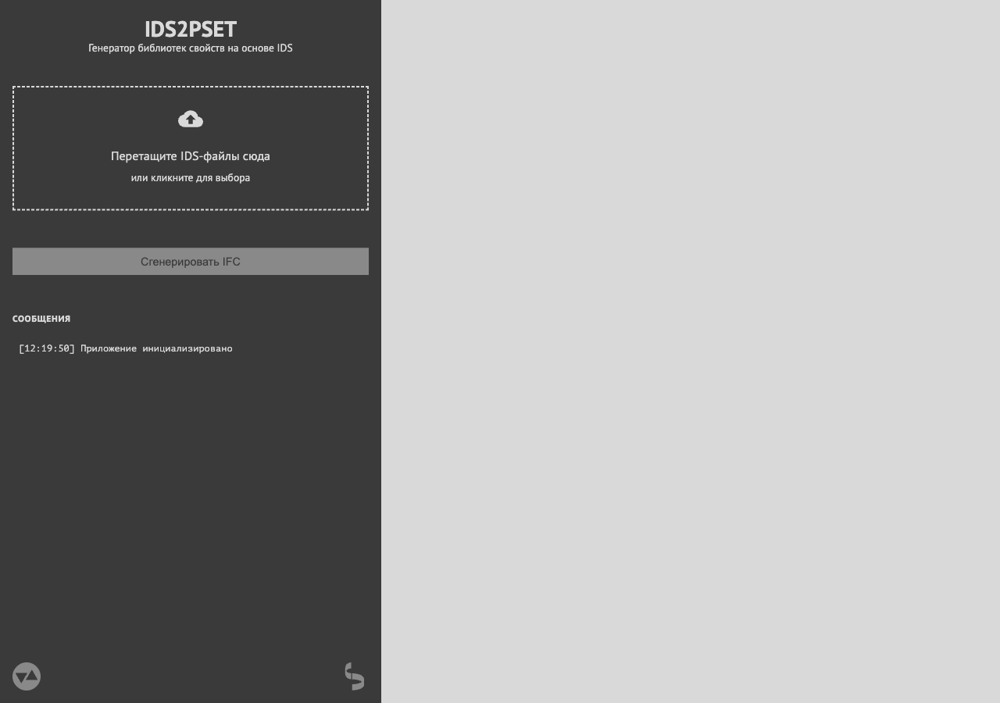

# Пользовательская инструкция IDS2PSET

**IDS2PSET** — генератор библиотек свойств IFC на основе IDS-спецификаций. Приложение работает полностью в браузере, не требует установки программ на компьютер.

> **Адрес приложения:** [https://vdobranov.github.io/IDS2PSET/](https://vdobranov.github.io/IDS2PSET/)

---

## 1. Быстрый старт

### Шаг 1. Откройте приложение

Перейдите по адресу **[https://vdobranov.github.io/IDS2PSET/](https://vdobranov.github.io/IDS2PSET/)** в браузере (Chrome, Firefox, Safari, Edge).

### Шаг 2. Загрузите IDS-файл

Перетащите файл `.ids` в зону загрузки на левой панели или **кликните** по зоне, чтобы выбрать файл через диалог.

### Шаг 3. Нажмите «Сгенерировать IFC»

После загрузки файла кнопка станет активной. Нажмите на неё.

### Шаг 4. Скачайте результат

После генерации рядом с файлом появится кнопка **«Скачать IFC»**. Готовый файл библиотеки свойств сохранится на вашем компьютере.

---

## 2. Пошаговая инструкция

### Шаг 1: Загрузка IDS-файла

IDS-файл — это XML-документ, содержащий спецификацию требований к информационной модели здания (BIM).

1. Откройте приложение в браузере.
2. На левой панели найдите зону загрузки с надписью **«Перетащите IDS-файлы сюда»**.
3. Перетащите один или несколько файлов `.ids` (или `.xml`) в эту зону. Альтернативно — **кликните** по зоне и выберите файлы в открывшемся диалоге.

**Что произойдёт после загрузки:**

- Файл появится в списке загруженных файлов на левой панели.
- В разделе **«Сообщения»** отобразится запись о парсинге файла.
- В основной области появятся найденные шаблоны свойств (PSet).
- Кнопка **«Сгенерировать IFC»** станет активной (если есть данные для генерации).

---

### Шаг 2: Просмотр шаблонов свойств

После загрузки IDS-файла приложение отображает найденные шаблоны свойств (PSet — Property Set, набор свойств).

**Как читать информацию о PSet:**

- **Заголовок PSet** — имя набора свойств и типы IFC-сущностей, к которым он применяется (в скобках). Например: `МОГЭ_Информация (IFCSITE, …, IFCBUILDINGELEMENTPROXY [18])` — PSet применяется к 18 типам элементов.
- **Каждое свойство** отображается с указанием типа данных и формата. Например: `Наименование (IFCTEXT, P_SINGLEVALUE)` — свойство текстового типа с единственным значением.
- **Предупреждение оранжевым цветом** — некоторые свойства описаны регулярными выражениями (regex). Такие свойства **не будут** включены в IFC-файл.

**Навигация между колонками:**

Если загружено несколько IDS-файлов, каждый файл отображается в отдельной колонке. Используйте кнопки **←** и **→** над колонками для переключения.

---

### Шаг 3: Генерация IFC

1. Убедитесь, что кнопка **«Сгенерировать IFC»** на левой панели активна (светло-серая, не тёмная).
2. **Нажмите** кнопку.
3. Дождитесь завершения генерации. Приложение использует Python (Pyodide) для создания IFC-файла — это может занять несколько секунд.
4. В разделе **«Сообщения»** появится запись **«IFC сгенерирован»**.
5. В списке файлов рядом с загруженным IDS появится статус **«Готово»** и кнопка **«Скачать IFC»**.

---

### Шаг 4: Скачивание IFC-файла

1. После генерации найдите в списке файлов кнопку **«Скачать IFC»**.
2. **Нажмите** кнопку — файл автоматически сохранится в папку загрузок вашего браузера.
3. Имя файла формируется так: `{имя_вашего_ids}_PSet_Library.ifc`

Полученный IFC-файл — это библиотека шаблонов свойств, которую можно импортировать в BIM-программы (Revit, ArchiCAD и другие).

---

## 3. Интерфейс приложения

Интерфейс разделён на две области:

### Левая панель (sidebar)

| Элемент | Описание |
|---------|----------|
| **Заголовок** | Название приложения «IDS2PSET» и подпись «Генератор библиотек свойств на основе IDS» |
| **Зона загрузки** | Область с пунктирной рамкой. Перетащите сюда IDS-файлы или кликните для выбора |
| **Список файлов** | Загруженные IDS-файлы с предупреждениями, статусом генерации и кнопкой скачивания |
| **Кнопка «Сгенерировать IFC»** | Запускает процесс создания IFC-файла. Неактивна, пока не загружены данные |
| **Раздел «Сообщения»** | Лог операций с временными метками: загрузка, парсинг, генерация, ошибки |
| **Футер** | Иконки: контакт разработчика (email) и ссылка на IfcOpenShell |

### Основная область

| Элемент | Описание |
|---------|----------|
| **Заголовок «Найденные шаблоны свойств»** | Появляется после загрузки IDS-файла |
| **Навигация** | Строка с названием текущего файла и кнопки ← → для переключения между колонками |
| **Колонки PSet** | Карточки с шаблонами свойств: имя PSet, применяемые типы сущностей, список свойств с типами данных |

---

## 4. Поддержка нескольких файлов

Приложение позволяет загрузить **несколько IDS-файлов одновременно**:

- Каждый файл отображается отдельной карточкой в списке файлов на левой панели.
- PSet из каждого файла группируются в отдельные колонки в основной области.
- Навигация **← →** переключает между колонками разных IDS-файлов.
- Генерация IFC происходит **для каждого файла отдельно** — у каждого будет своя кнопка **«Скачать IFC»**.
- Чтобы удалить файл, нажмите **×** рядом с его именем в списке.

---

## 5. Предупреждения о регулярных выражениях

IDS-файлы могут содержать свойства, описанные с помощью регулярных выражений (regex, xs:pattern). Приложение обрабатывает их следующим образом:

### Оранжевый текст в карточке файла

> «N свойств описаны регулярными выражениями»

Эти свойства **не будут включены** в сгенерированный IFC-файл, так как IFC не поддерживает шаблоны регулярных выражений в определениях свойств. Генерация продолжится для остальных свойств.

### Текст «Возможно, IDS некорректен»

Если в IDS используются простые регулярные выражения (например, `simpleValue` с regex-паттерном вместо конкретного значения), приложение предупредит об этом. Рекомендуется проверить исходный IDS-файл.

### Красный текст: «IFC не будет сгенерирован»

Если **все** PSet в файле описаны только регулярными выражениями — генерация невозможна. Кнопка **«Сгенерировать IFC»** останется неактивной, колонки с PSet не отобразятся.

### Предупреждение внутри PSet

Под заголовком PSet может появиться строка:
> «N свойств описаны регулярными выражениями — не будут созданы»

Это означает, что конкретный шаблон свойств содержит свойства с regex, которые будут пропущены при генерации.

---

## 6. Частые вопросы

### Что такое IDS-файл?

IDS (Information Delivery Specification) — это стандарт ISO 29481, описывающий требования к информации в BIM-моделях. Файл `.ids` содержит спецификации: какие свойства должны быть у каких элементов модели. IDS используется для проверки BIM-моделей на соответствие требованиям заказчика или нормативных документов.

### Что такое PSet?

PSet (Property Set, шаблон свойств) — это набор свойств, применяемый к определённым типам элементов IFC-модели. Например, PSet «МОГЭ_Информация» может содержать свойства: наименование, кадастровый номер, тип зоны — и применяться к объектам типа IFCBUILDING, IFCROOM и др.

### Почему кнопка «Сгенерировать IFC» неактивна?

Кнопка неактивна в трёх случаях:
1. **Файлы ещё не загружены** — перетащите IDS-файл в зону загрузки.
2. **Файл загружен, но не распарсен** — проверьте раздел «Сообщения» на наличие ошибок.
3. **Все PSet описаны регулярными выражениями** — в этом случае генерация невозможна. В карточке файла будет красное предупреждение.

### Почему некоторые свойства не попали в IFC?

Свойства, описанные в IDS с помощью регулярных выражений (xs:pattern), **не включаются** в IFC-файл. Формат IFC не поддерживает определение допустимых значений через regex. Такие свойства отображаются в интерфейсе, но отмечаются предупреждением и пропускаются при генерации.

### Можно ли загрузить несколько IDS сразу?

**Да.** Перетащите несколько файлов в зону загрузки или выберите их в диалоге (зажмите Ctrl/Command для множественного выбора). Каждый IDS будет обработан независимо.

### Где хранится сгенерированный IFC?

IFC-файл сохраняется в **папку загрузок** вашего браузера по умолчанию. При нажатии **«Скачать IFC»** браузер предложит сохранить файл. Имя файла: `{имя_загруженного_ids}_PSet_Library.ifc`.

### Работает ли приложение без интернета?

**Нет.** При первом открытии приложение загружает библиотеку Pyodide (Python для браузера) из CDN. После загрузки страница может работать без интернета до перезагрузки. Для повторного использования необходимо подключение к интернету.

### Какие форматы IFC поддерживаются?

Приложение генерирует файлы в формате **IFC4** (Industry Foundation Classes, версия 4). Этот формат поддерживается большинством современных BIM-программ: Revit, ArchiCAD, Tekla, Allplan и другими.

### Можно ли отредактировать IDS перед загрузкой?

Приложение **не редактирует** IDS-файлы. Загружайте готовый IDS. Если нужно изменить спецификацию — отредактируйте файл в текстовом редакторе или специализированном инструменте перед загрузкой.

### Как удалить загруженный файл?

Нажмите на значок **×** справа от имени файла в списке загруженных файлов на левой панели. Это удалит файл и все связанные с ним PSet из текущего сеанса.

---

## 7. Технические требования

| Параметр | Требование |
|----------|-----------|
| **Браузер** | Chrome, Firefox, Safari, Edge (последние версии) |
| **Интернет** | Необходим для загрузки Pyodide (Python-среда в браузере) |
| **Разрешение экрана** | Рекомендуется 1280×900 и выше |
| **Размер IDS-файла** | Ограничен возможностями браузера (обычно до 50–100 МБ) |
| **Поддерживаемые форматы** | `.ids`, `.xml` |
| **Формат вывода** | IFC4 (`.ifc`) |

---

## Контакты

По вопросам и предложениям обращайтесь: **vy.dobranov@yandex.ru**

Библиотека для работы с IFC: [IfcOpenShell](https://ifcopenshell.org/)
